# GBM Monte Carlo Option Pricing — Python & MATLAB

## Project Overview

This project extends a basic Brownian motion simulation into a small quantitative finance project.

It simulates stock-price paths using **Geometric Brownian Motion (GBM)**, prices **European call and put options** using Monte Carlo simulation, compares the estimates with **Black-Scholes analytical prices**, and analyses simulation error through confidence intervals and convergence plots.

The project includes both:

- a **Python implementation** 
- a **MATLAB implementation** linked to Computational Methods in Finance module I am studying

## Mathematical Model

Under the risk-neutral measure, the stock price is modelled as:

```text
dS_t = r S_t dt + sigma S_t dW_t
```

Using exact GBM discretisation:

```text
S_{t+dt} = S_t * exp((r - 0.5 sigma^2) dt + sigma sqrt(dt) Z)
```

where:

```text
Z ~ N(0, 1)
```

For a European call:

```text
Payoff = max(S_T - K, 0)
```

For a European put:

```text
Payoff = max(K - S_T, 0)
```

The Monte Carlo option price is:

```text
Option Price = exp(-rT) * average(payoff)
```

## Folder Structure

```text
gbm_monte_carlo_python_matlab/
│
├── README.md
├── requirements.txt
├── .gitignore
│
├── python/
│   └── gbm_monte_carlo_project.py
│
├── matlab/
│   ├── brownian_motion_basic.m
│   └── gbm_monte_carlo_option_pricing.m
│
├── outputs/
│   └── .gitkeep
│
└── report/
    └── project_summary_template.md
```

## Results and Visualisations

### Pricing Summary

| Option | Black-Scholes Price | Monte Carlo Price | Standard Error | 95% Confidence Interval | Absolute Error |
|---|---:|---:|---:|---:|---:|
| Call | 10.4506 | 10.4898 | 0.0661 | [10.3602, 10.6195] | 0.0393 |
| Put | 5.5735 | 5.5755 | 0.0387 | [5.4996, 5.6514] | 0.0020 |

The Monte Carlo call and put prices are close to the Black-Scholes analytical benchmarks, showing that the simulation is correctly approximating the theoretical option values.

### Simulated GBM Stock-Price Paths

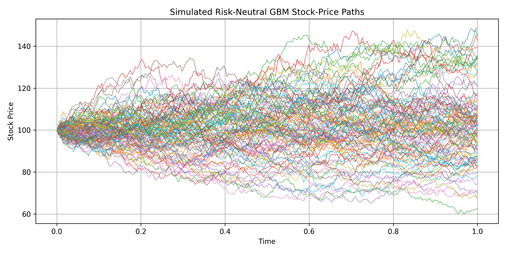

### Terminal Stock Price Distribution

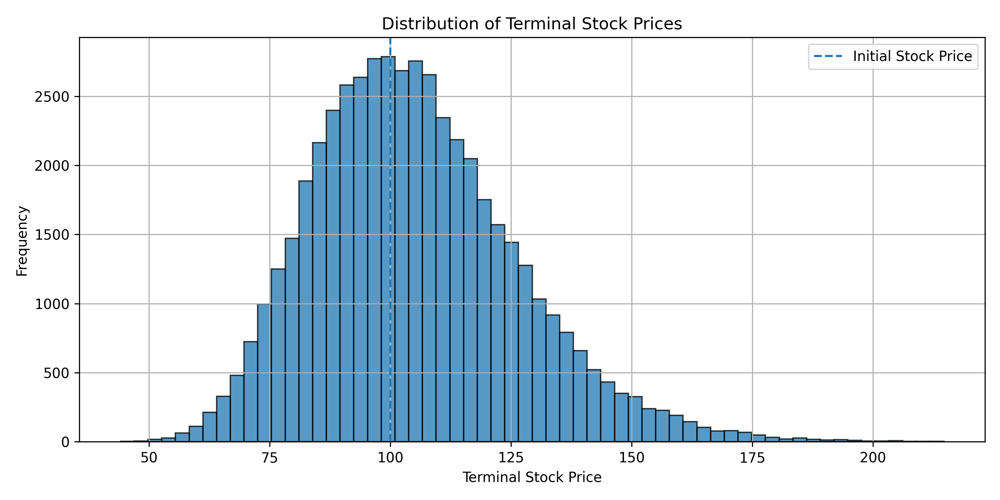

### European Call Payoff Distribution

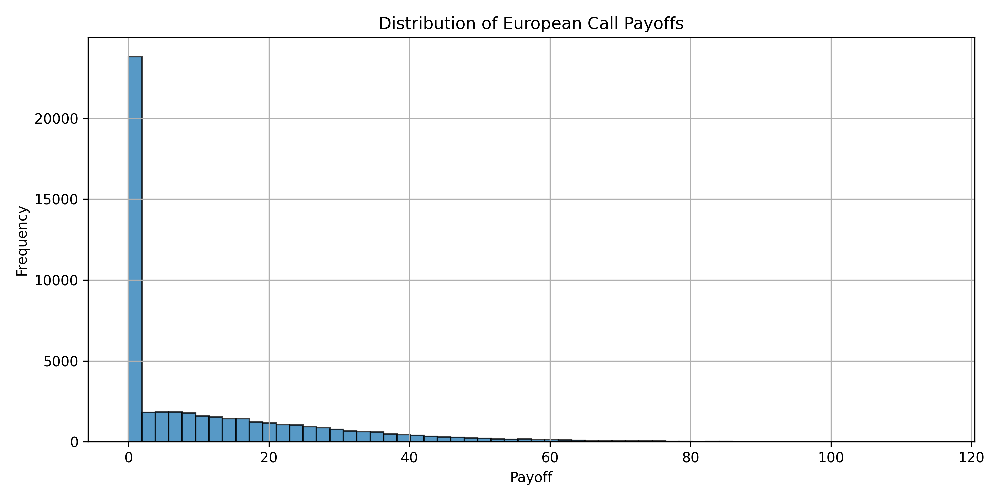

### Monte Carlo Convergence

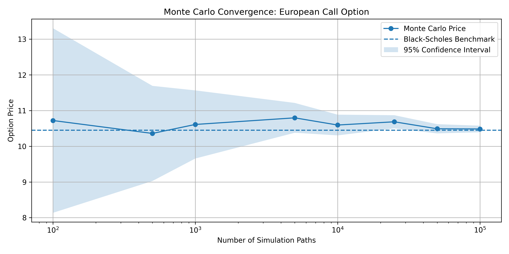

The convergence chart shows the Monte Carlo price approaching the Black-Scholes benchmark as the number of simulated paths increases. The confidence interval narrows as the number of simulations increases, showing the reduction in estimation error.

## Output Data

- [Option pricing summary CSV](outputs/option_pricing_summary.csv)
- [Monte Carlo convergence results CSV](outputs/call_convergence_results.csv)

## Black-Scholes Greeks and Implied Volatility Extension

This project was extended to include Black-Scholes Greeks, implied volatility recovery, and synthetic volatility smile/surface visualisations.

The Greeks measure the sensitivity of option prices to key market variables. This is important because option traders and quantitative analysts do not only care about the theoretical option price; they also care about how that price changes when the underlying stock price, volatility, time to maturity, or interest rates change.

| Greek | Meaning |
|---|---|
| Delta | Sensitivity of the option price to the underlying stock price |
| Gamma | Sensitivity of Delta to changes in the underlying stock price |
| Vega | Sensitivity of the option price to volatility |
| Theta | Sensitivity of the option price to time decay |
| Rho | Sensitivity of the option price to interest rates |

### Greeks Visualisations

#### Delta

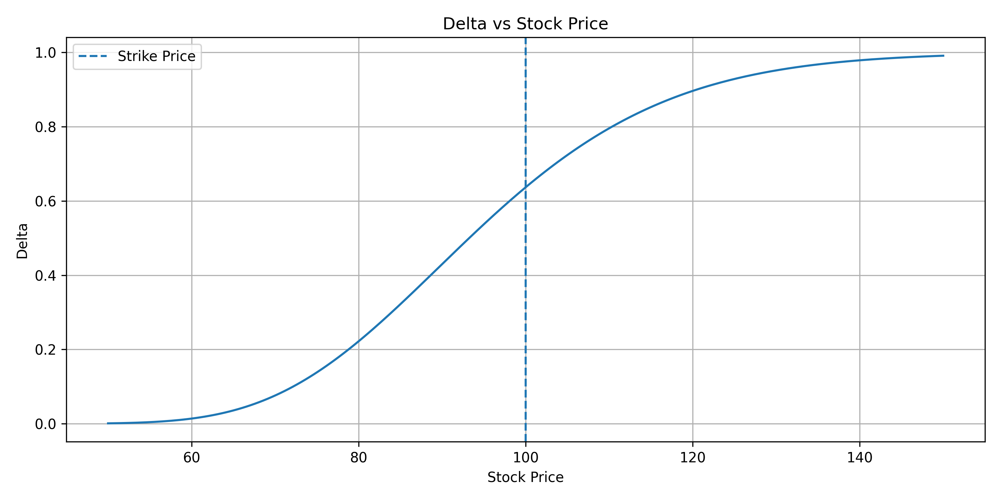

Delta shows how the option price changes when the underlying stock price changes. For a call option, Delta moves from close to 0 when the option is deep out-of-the-money to close to 1 when the option is deep in-the-money.

#### Gamma

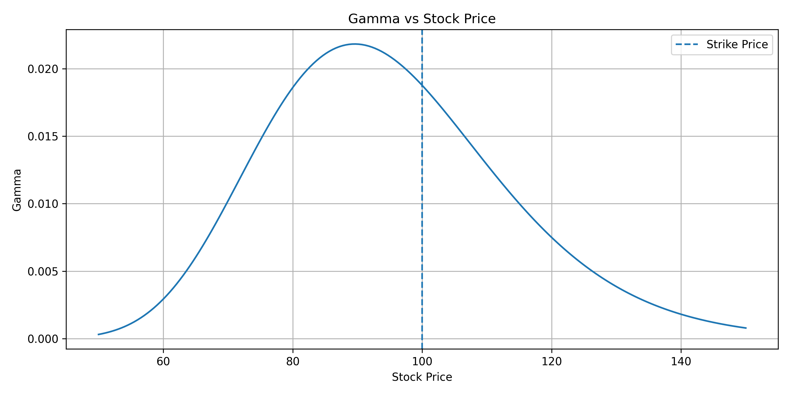

Gamma measures how quickly Delta changes as the stock price moves. Gamma is usually highest near the strike price, meaning at-the-money options have the most unstable hedge ratio.

#### Vega

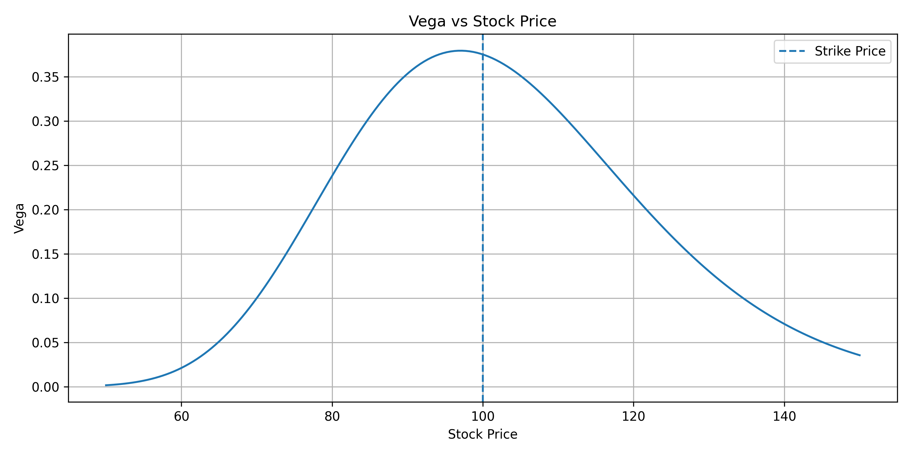

Vega measures the sensitivity of the option price to changes in volatility. It is usually highest near the strike price, showing that at-the-money options are highly exposed to implied volatility changes.

#### Theta

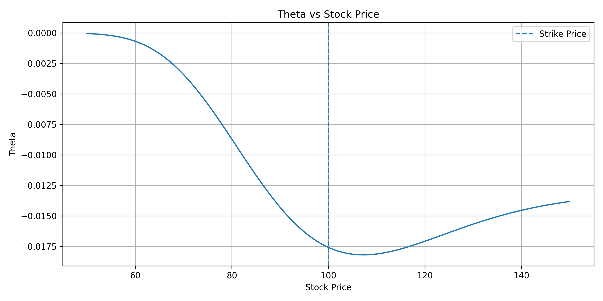

Theta measures time decay. For long options, Theta is usually negative, meaning the option loses value as time passes, all else equal.

#### Rho

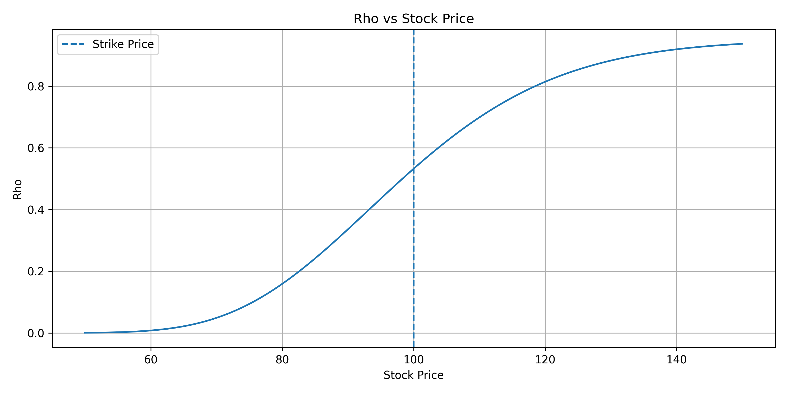

Rho measures sensitivity to changes in the risk-free interest rate. For equity options, Rho is usually less important than Delta, Gamma, Vega and Theta, but it is still part of the Black-Scholes sensitivity framework.

### Synthetic Volatility Smile

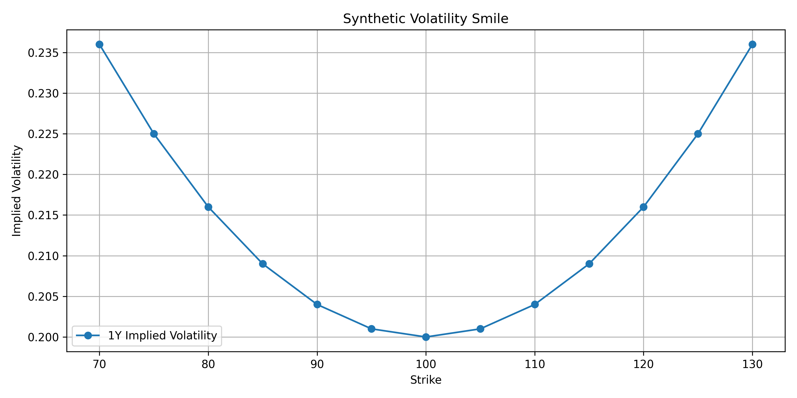

The volatility smile shows implied volatility across different strikes for a fixed maturity. In real markets, implied volatility is usually not constant across strikes. This highlights one of the key limitations of the basic Black-Scholes model, which assumes constant volatility.

### Synthetic Volatility Surface

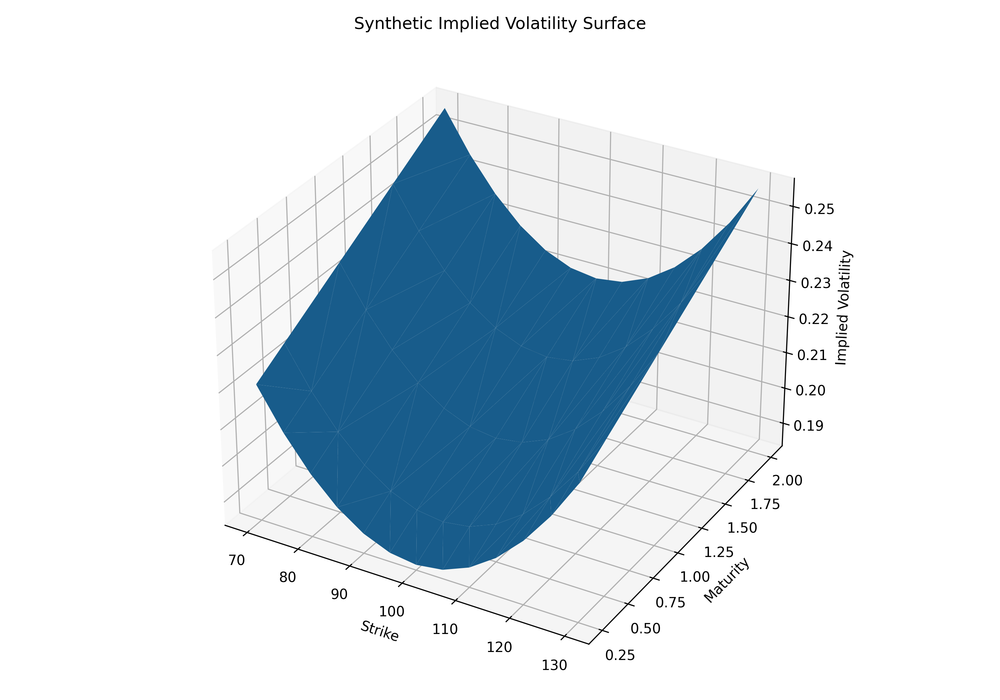

The volatility surface extends the volatility smile across both strike and maturity. It shows how implied volatility changes across different option strikes and expiries. This is closer to how options are analysed in practice, where traders look at the full volatility surface rather than one volatility number.

### Additional Output Data

- [Greeks vs stock price CSV](outputs/greeks_vs_stock_price.csv)
- [Synthetic option market implied volatility CSV](outputs/synthetic_option_market_iv.csv)
